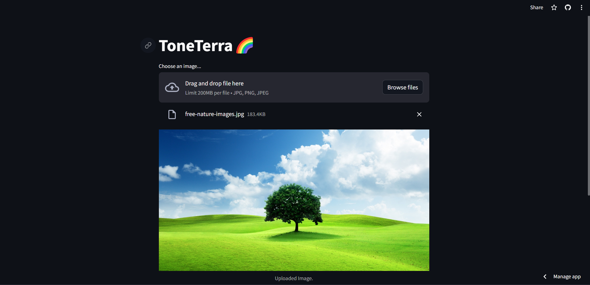
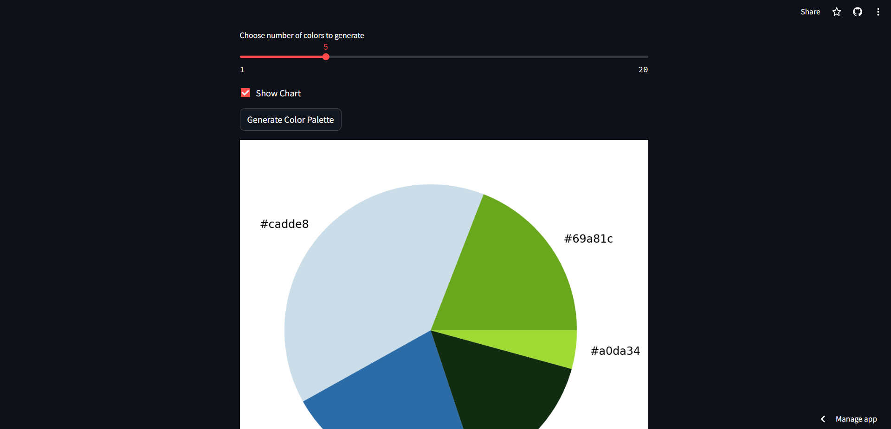
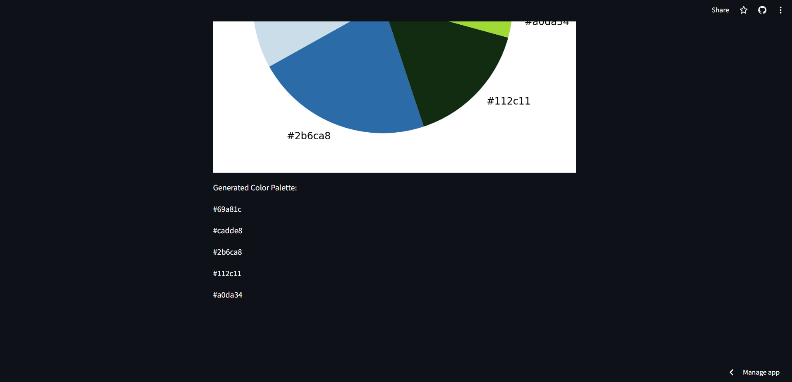

# ToneTerra🌈

ToneTerra is a Color Palette Generator that helps you extract and visualize dominant colors from images.

## Features

- **Color Extraction:** Utilizes the KMeans clustering algorithm to identify dominant colors in an image.
- **Interactive Interface:** A user-friendly interface with sliders and checkboxes for customization.
- **Color Chart:** Optionally displays a pie chart showcasing the distribution of colors in the image.
- **Easy to Use:** Simply upload an image, choose the number of colors, and generate your color palette.

## Installation

To run ToneTerra locally, follow these steps:

1. Clone the repository:
   ```bash
   git clone <repository_url>
2. Install dependencies:
   ```bash
   pip install requirements.txt
3. Run the application using Streamlit CLI:
   ```bash
   streamlit run main.py
   
# Usage
1. Upload an image using the file uploader.
2. Adjust the sliders to customize the number of colors and chart display.
3. Click the "Generate Color Palette" button.
4. Explore the generated color palette and enjoy!

# Screenshots



